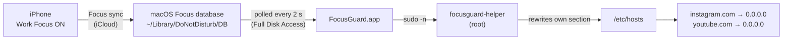

# FocusGuard

[](https://github.com/felipecatzkocourek/focusguard/actions/workflows/ci.yml)


[](LICENSE)

**A macOS app that blocks distracting websites while a Focus mode is on — with your
iPhone as the remote.**

Switch to **Work** (or any Focus you choose) in Control Center on your iPhone, and within
seconds Instagram and YouTube stop loading on your Mac. There are no shortcuts or commands
to trigger it, and none that can turn it off. A dashboard on your second monitor shows
that blocking is on, how long you've been focused today, and what's blocked. When you genuinely need
a blocked site (that one YouTube tutorial), you can unlock it for a few minutes, but only
after waiting out a short countdown and writing down why.

> **Status:** v0.1 in development. See the [roadmap](#roadmap).

<!-- TODO: add a screenshot / GIF of the dashboard (docs/screenshot.png) -->

## Features

- **Focus-driven:** FocusGuard watches the system Focus itself and blocks while any of
  the modes you pick (Work, Personal…) is on. Turn it on from your iPhone, Mac or Apple
  Watch; Focus sync does the rest.
- **Hard to talk your way out of:** blocking only ends when the Focus really turns off.
  No URL, shortcut or command can stop it. If `/etc/hosts` is edited by hand during a
  session, the block is restored within seconds.
- **System-wide blocking:** works in every browser (Safari, Chrome, Firefox, Arc…) because
  it blocks at the DNS level through `/etc/hosts`, including IPv6 and `www.`/`m.` variants.
- **Dashboard for a second monitor:** big status, time in Work today, live per-site state
  and a log of the day. It remembers which screen it lives on.
- **Friction, not a hard wall:** temporarily allow one site for 5, 15 or 30 minutes after a
  countdown (default 60 s) and a typed reason. It re-blocks automatically, even if you
  quit the app.
- **No loosening in the moment:** while blocking you can add sites but not remove them,
  and the trigger modes and friction settings are locked.
- **Plays nicely with others:** only edits its own marked section of `/etc/hosts`; other
  tools' entries are left untouched.

## How it works



1. **Focus sync.** With *Share Across Devices* on (System Settings → Focus), turning a
   Focus on or off on any of your devices changes it on the Mac too.
2. **Focus detection.** Apple has no public API that tells an app *which* Focus is on, so
   FocusGuard reads the same database Control Center writes (`Assertions.json` and
   `ModeConfigurations.json`). That needs Full Disk Access. The parser is defensive: if a
   macOS update changes the format, the app says so and **keeps the current state**
   instead of guessing, so a failed read never silently unblocks anything.
3. **The app** decides whether a session is running, tracks temporary allowances and the
   activity log, and compares the plan with the actual `/etc/hosts` on every poll.
4. **The privileged helper** is the only component that runs as root. It validates every
   hostname and rewrites FocusGuard's section of `/etc/hosts` atomically, then flushes the
   DNS cache.

### Project structure

```
Sources/
  FocusGuardCore/     Pure logic, no UI, fully unit-tested
    Domain.swift        normalize & validate user input → hostnames
    HostsFile.swift     rewrite only FocusGuard's section of /etc/hosts
    BlockState.swift    Work state, temporary allowances, BlockPlanner
    ActivityLog.swift   events + "time in Work today"
    FocusDatabase.swift parse the macOS Focus database (active mode, mode names)
    JSONStore.swift     persistence in ~/Library/Application Support/FocusGuard
  FocusGuardHelper/   Root CLI: block <hosts…> | clear | status
  FocusGuard/         AppKit + SwiftUI app (Focus monitor, dashboard, menu bar)
Tests/FocusGuardCoreTests/
helper/               install.sh / uninstall.sh for the privileged helper
scripts/              build-app.sh, test.sh
```

The split is deliberate: everything that decides *what* to block lives in
`FocusGuardCore`, where it can be tested without a UI or root. The app and the helper are
thin shells around it.

## Installation

Requirements: macOS 14 Sonoma or later and Swift 6 (the Xcode **Command Line Tools** are
enough; full Xcode is not required).

```bash
git clone https://github.com/felipecatzkocourek/focusguard.git
cd focusguard
./scripts/build-app.sh --install
open ~/Applications/FocusGuard.app
```

Then follow the **Setup** tab in the app:

1. **Install the helper.** Click *Install Helper…* and enter your admin password once.
2. **Grant Full Disk Access.** System Settings → Privacy & Security → Full Disk Access →
   **+** → FocusGuard. The Setup tab shows the detected Focus once it works.
3. **Pick your trigger modes** in Settings (Work by default).
4. **Drag the window to your second monitor** and turn on *Open FocusGuard when I log in*.

### Uninstall

```bash
sudo ~/Applications/FocusGuard.app/Contents/Resources/uninstall.sh
rm -rf ~/Applications/FocusGuard.app ~/Library/Application\ Support/FocusGuard
```

`uninstall.sh` removes the helper and its sudoers rule and clears FocusGuard's section of
`/etc/hosts`, so nothing stays blocked.

## Security

Editing `/etc/hosts` needs root, and a productivity app should not get blanket admin
rights. FocusGuard keeps the privileged part as small and auditable as possible:

| Concern | How it's handled |
| --- | --- |
| What runs as root | Only `focusguard-helper` (~120 lines). The app itself never runs as root. |
| Who can replace the helper | It's installed in `/Library/PrivilegedHelperTools`, owned by `root:wheel`, mode `755`. A normal user can't modify it. |
| Password-less sudo scope | `/etc/sudoers.d/focusguard` allows **only that one binary** for **only your user**. The rule is checked with `visudo -cf` before it's installed. |
| Full Disk Access | Used only to read the two Focus database files. The app never writes there. |
| Injection into `/etc/hosts` | Every argument must pass a strict RFC 1123 hostname check. Newlines, spaces, IPs and anything else are rejected before the file is touched. |
| Damaging the hosts file | Only lines between `# BEGIN FocusGuard` and `# END FocusGuard` are ever rewritten. Writes are atomic (temp file + `rename`), so a crash can't leave a half-written file. |

The worst a compromised user account can do with the helper is block or unblock websites.

## Limitations

- **This is a commitment device, not parental controls.** An admin user can always undo
  it (edit `/etc/hosts`, uninstall the helper). The point is to break the reflex, not to
  be unbreakable.
- **Browsers cache DNS.** A tab that's already open may keep working for up to about a
  minute after blocking starts. The helper flushes the system cache, but Chrome keeps its
  own.
- **No wildcard subdomains.** `/etc/hosts` can't express `*.youtube.com`; FocusGuard
  blocks the bare domain plus `www.` and `m.`.
- **DNS-over-HTTPS** set to a custom provider in a browser can bypass `/etc/hosts`.
- **The Focus database format is undocumented.** It works on current macOS, but a future
  update could change it. FocusGuard detects that and keeps the last known state.
- **Ad-hoc signing:** every rebuild looks like a new app to macOS, so Full Disk Access has
  to be re-enabled after building a new version.
- **FocusGuard has to be running** to start or end a session (launch at login covers this).
  Sites that are already blocked stay blocked if it quits.
- **Scheduled Focus** (time- or location-based) might not appear in the database the same
  way as a manual toggle. This is untested.

## Development

```bash
./scripts/test.sh          # unit tests (Swift Testing)
swift build                # debug build of everything
./scripts/build-app.sh     # build/FocusGuard.app
```

See [CONTRIBUTING.md](CONTRIBUTING.md) for the branching model, commit conventions and
release process.

## Roadmap

Tracked in [milestones](https://github.com/felipecatzkocourek/focusguard/milestones):

- **v0.1.0:** Focus-triggered blocking, dashboard, friction-gated temporary unblocks
- **v0.2.0:** Pomodoro timer on the dashboard ([#6](https://github.com/felipecatzkocourek/focusguard/issues/6))
- **Backlog:** a custom "you're in Work mode" page, an app icon, a stable signing
  identity so permissions survive rebuilds

## Tech stack

Swift 6 (strict concurrency) · SwiftUI + AppKit · Swift Package Manager · Swift Testing ·
Observation · ServiceManagement · GitHub Actions

## License

[MIT](LICENSE) © 2026 Felipe Kocourek
